# Kaspa Messenger Indexer Architecture

This document provides a comprehensive overview of the Kaspa blockchain indexer architecture focused on decentralized messaging. The system is built around an actor-based architecture with sophisticated database partitioning and real-time synchronization capabilities.

## System Overview

The indexer consists of four main crates that work together to provide a complete blockchain indexing solution:

```mermaid
graph LR
    A[indexer<br/>• API Server<br/>• HTTP Routes<br/>• Context Mgmt] <--> B[indexer-actors<br/>• DataSource<br/>• BlockProcessor<br/>• VirtChainProc]
    B <--> C[indexer-db<br/>• Partitions<br/>• Storage Mgmt<br/>• Data Types]
    C <--> D[protocol<br/>• Operations<br/>• Deserializer<br/>• Message Types]
```

## Core Architecture Patterns

### 1. Actor-Based Processing with Supervision

The system uses an actor model where each component runs independently and communicates through channels, with DataSource acting as the supervisor:

```mermaid
graph TD
    A[DataSource<br/>🎯 SUPERVISOR<br/>• RPC Mgmt<br/>• Notifications<br/>• Commands<br/>• Lifecycle Control] --> B[BlockProcessor<br/>• Block Parsing<br/>• Gap Filling<br/>• Message Extr.<br/>• State Mgmt]
    B --> C[VirtualChainProc<br/>• VCC Handling<br/>• Sync State<br/>• Pending Res.<br/>• Block Deps]
    A -->|Direct VCC| C
    A -->|Shutdown Control| B
    A -->|Shutdown Control| C
    B -->|Status Reports| A
    C -->|Status Reports| A
```

### 2. Database Partitioning Strategy

The database is partitioned by data type and access pattern:

```mermaid
graph TB
    DB[indexer-db] --> H[Headers<br/>Block metadata]
    DB --> M[Messages<br/>Encrypted messaging data]  
    DB --> P[Processing<br/>Transaction acceptance tracking]
    
    H --> H1[BlockCompactHeaders<br/>Block hash → blue_work, daa_score]
    H --> H2[BlockGaps<br/>Gap tracking for sync]
    H --> H3[DaaIndex<br/>DAA score → block hash lookup]
    
    M --> M1[HandshakeByReceiver<br/>Receiver → handshake data]
    M --> M2[HandshakeBySender<br/>Sender → handshake data]
    M --> M3[ContextualMessage<br/>Sender → contextual messages]
    M --> M4[PaymentByReceiver<br/>Receiver → payment data]
    M --> M5[PaymentBySender<br/>Sender → payment data]
    
    P --> P1[AcceptingBlockToTxIds<br/>Block → transaction IDs]
    P --> P2[TxIdToAcceptance<br/>TX ID → acceptance metadata]
    P --> P3[PendingSenders<br/>Pending sender resolutions]
```

## Detailed Component Analysis

### DataSource Actor

**Responsibilities:**
- Manages RPC connection to Kaspa node
- Handles connection/disconnection events
- Routes notifications to appropriate processors
- Provides request/response interface for data fetching
- **Acts as supervisor actor controlling the entire system lifecycle**
- **Orchestrates graceful shutdown sequence across all actors**

**Communication Flow:**

**Key Features:**
- Automatic reconnection with exponential backoff
- Queue management for requests during disconnection
- Notification listener lifecycle management
- **Supervisor pattern implementation for actor lifecycle management**

**Graceful Shutdown Orchestration:**
The DataSource implements a sophisticated shutdown sequence as the system supervisor:

### BlockProcessor Actor

**Responsibilities:**
- Processes individual blocks from real-time notifications
- Extracts and parses encrypted messages from transactions
- Manages gap filling for missed blocks
- Maintains block header database

**State Management:**
The BlockProcessor maintains several key states:

**Processing States:**
1. **Initial Connection**: Detect existing gaps and spawn gap fillers
2. **Real-time Processing**: Process new blocks as they arrive
3. **Gap Detection**: When reconnecting, create gaps between last processed and current sink
4. **Gap Filling**: Coordinate multiple BlockGapFiller actors
5. **Shutdown**: Interrupt all gap fillers and complete gracefully

**Message Processing Flow:**
1. **Transaction Analysis**: Parse transaction outputs for encrypted messages
2. **Operation Deserialization**: Decode sealed operations (handshakes, payments, messages)  
3. **Sender Resolution**: Determine sender addresses from UTXO references
4. **Database Storage**: Store in appropriate partitions based on message type
5. **Acceptance Tracking**: Queue for virtual chain confirmation
6. **Compact Header Generation**: Send processed block metadata to VirtualChainProcessor

### VirtualChainProcessor Actor

**Responsibilities:**
- Handles Virtual Chain Changed (VCC) notifications **directly from DataSource**
- Manages transaction acceptance confirmations
- Resolves pending sender addresses
- Maintains sync state between historical and real-time processing
- **Block Dependency Management**: Only processes VCC notifications when all referenced blocks are known

**Block Dependency Logic:**
The VirtualChainProcessor implements sophisticated block dependency handling:

**Synchronization States:**

**State Details:**
- **Initial**: First connection, determine sync requirements based on database cursors
- **Syncing**: Historical catch-up using VirtualChainSyncer, queue real-time VCC notifications
- **Synced**: Real-time processing of VCC notifications, maintain processed_blocks ring buffer

### Database Architecture (indexer-db)

#### Partition Strategy

Each partition is optimized for specific access patterns:

```mermaid
graph TB
    subgraph "PartitionId Enumeration"
        P1[1 - Metadata<br/>System cursors and metadata]
        P2[2 - BlockCompactHeaders<br/>Block hash → header data]
        P3[3 - BlockDaaIndex<br/>DAA score → block hash]
        P4[4 - BlockGaps<br/>Gap tracking]
        P5[5 - HandshakeByReceiver<br/>Message handshakes by receiver]
        P6[6 - HandshakeBySender<br/>Message handshakes by sender]
        P7[7 - TxIdToHandshake<br/>Transaction → handshake mapping]
        P8[8 - ContextualMessageBySender<br/>Contextual messages]
        P9[9 - PaymentByReceiver<br/>Payments by receiver]
        P10[10 - PaymentBySender<br/>Payments by sender]
        P11[11 - TxIdToPayment<br/>Transaction → payment mapping]
        P12[12 - AcceptingBlockToTxIds<br/>Block → transaction tracking]
        P13[13 - TxIdToAcceptance<br/>Transaction acceptance metadata]
        P14[14 - PendingSenders<br/>Pending sender resolutions]
    end
```

#### Key Data Structures

- **AddressPayload**: Compact address representation with inverse versioning for efficient sorting
- **SharedImmutable<T>**: Zero-copy data structure using zerocopy traits for memory efficiency
- **Acceptance Tracking**: Complex system for tracking transaction confirmations across virtual chain changes

### Protocol Layer

Handles message protocol operations:

Messages are hex-encoded and prefixed with `ciph_msg:` in transaction outputs.

## Communication Flow Diagrams

### Real-Time Block Processing

### Virtual Chain Synchronization

### Sender Resolution Process

## Key Architectural Decisions

### 1. Supervised Actor Model Benefits
- **Isolation**: Each actor runs independently, preventing cascading failures
- **Scalability**: Actors can be distributed across threads/processes
- **Maintainability**: Clear separation of concerns and responsibilities
- **Controlled Lifecycle**: DataSource supervisor ensures proper startup/shutdown sequences
- **Graceful Degradation**: System can shutdown cleanly even with running background tasks

### 2. Database Partitioning Strategy  
- **Performance**: Optimized access patterns for different query types
- **Scalability**: Partitions can be distributed or cached independently
- **Consistency**: Transactional updates within partition boundaries

### 3. Dual Processing Paths
- **Real-time Path**: Block notifications for current blockchain state  
- **Historical Path**: Gap filling and synchronization for missed data
- **Convergence**: Both paths feed into the same database partitions

### 4. Message Protocol Design
- **Encryption**: All messages are encrypted before blockchain storage
- **Versioning**: Support for protocol evolution and backward compatibility
- **Efficiency**: Minimal blockchain footprint while maintaining functionality

### 5. Block Dependency Management
- **Consistency Guarantee**: VCC notifications are only processed when all referenced blocks are known
- **Queuing Strategy**: Real-time and sync VCC notifications are queued until block dependencies are satisfied
- **Ring Buffer**: Processed blocks maintained in memory for efficient dependency checking
- **Coordination**: BlockProcessor provides block availability signals to VirtualChainProcessor

## Performance Characteristics

### Memory Management
- **Zero-copy**: SharedImmutable<T> eliminates serialization overhead
- **Ring Buffers**: Bounded memory usage for processed blocks  
- **Lazy Loading**: Database partitions loaded on demand

### Concurrency Model
- **Channel-based**: All communication through typed channels
- **Non-blocking**: Async/await throughout the system
- **Backpressure**: Flow control prevents memory exhaustion

### Database Performance
- **Embedded**: fjall database eliminates network overhead
- **Transactions**: ACID properties for consistency
- **Partitioned**: Parallel access to different data types

## Error Handling and Resilience

### Connection Management
- **Automatic Reconnection**: Exponential backoff for RPC failures
- **Request Queuing**: Buffer requests during disconnection
- **Graceful Degradation**: System continues with available data

### Data Consistency
- **Transactional Updates**: Atomic writes within partitions
- **Rollback Capability**: Failed transactions leave system unchanged  
- **Pending Resolution**: Track incomplete operations for retry

### Actor Supervision and Lifecycle Management
- **Isolation**: Actor failures don't cascade to other components
- **Restart Semantics**: Failed actors can be restarted independently
- **Resource Cleanup**: Drop implementations ensure clean shutdown
- **Hierarchical Shutdown**: DataSource supervisor coordinates termination sequence:
  1. **Signal Propagation**: Shutdown signal sent to BlockProcessor and VirtualChainProcessor
  2. **Child Actor Termination**: VirtualChainSyncer and BlockGapFillers are stopped first
  3. **Status Confirmation**: Processors report completion to DataSource supervisor
  4. **Safe Termination**: DataSource shuts down only after all child actors are stopped
- **Graceful Task Completion**: Active operations (gap filling, virtual chain sync) complete gracefully
- **State Preservation**: Database transactions complete before shutdown

## Supervisor Pattern Implementation

The DataSource actor implements a comprehensive supervisor pattern that ensures system reliability and graceful operation:

### Startup Coordination
1. **Connection Establishment**: DataSource connects to Kaspa node first
2. **Processor Initialization**: Spawns BlockProcessor and VirtualChainProcessor  
3. **Notification Registration**: Establishes RPC notification listeners
4. **Ready State**: System begins processing when all components are initialized

### Runtime Supervision
- **Health Monitoring**: Tracks processor state via channel closures and status reports
- **Error Recovery**: Handles RPC disconnections and processor failures
- **Resource Management**: Monitors and controls spawned child actors

### Shutdown Coordination

This architecture provides a robust, scalable foundation for indexing Kaspa blockchain data while supporting encrypted messaging capabilities through a well-defined protocol layer and supervised actor lifecycle management.
